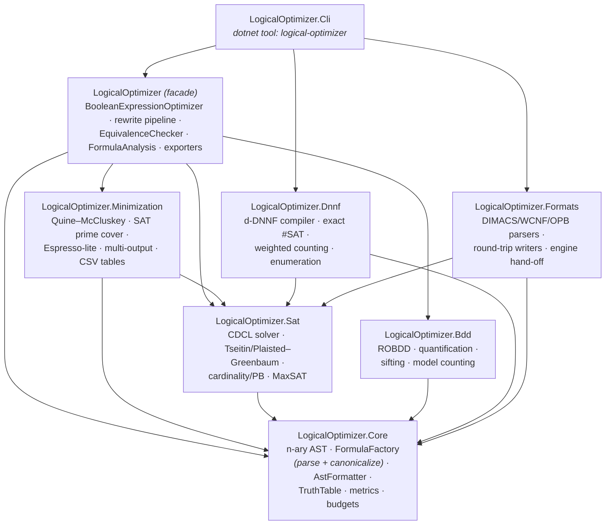
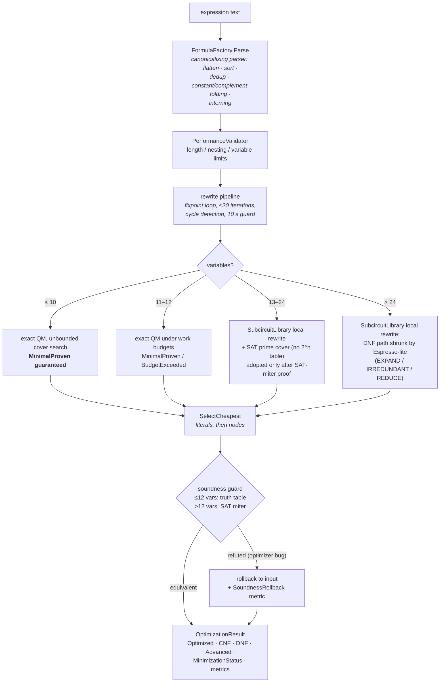
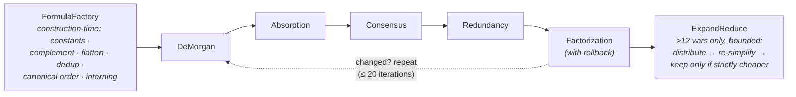
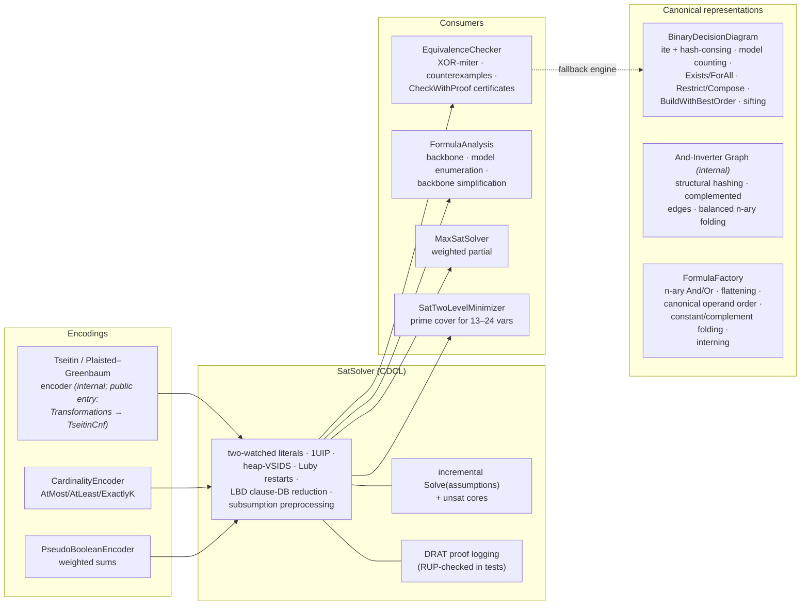

# LogicalOptimizer

> **Verified Boolean reasoning toolkit for .NET**  
> Optimize, compare, count, and solve Boolean formulas with zero runtime dependencies.

LogicalOptimizer is a dependency-free .NET toolkit for **verified** Boolean optimization,
equivalence checking, SAT solving, model counting, and knowledge compilation. Every
optimization result is checked for equivalence with the input; minimality and
resource-limit outcomes are reported explicitly — there are no silent fallbacks.

## Why LogicalOptimizer

- **Verified results** — every optimization is proven equivalent to the input before it is returned (truth table up to 12 variables, built-in SAT miter beyond).
- **Explicit proof status** — minimality is never silently downgraded: `OptimizationResult.MinimizationStatus` reports `MinimalProven` / `BudgetExceeded` / `Heuristic`.
- **Pure managed .NET** — zero production dependencies, Native AOT and trimming supported.

## Install

```bash
dotnet add package LogicalOptimizer            # facade: Core + Sat + Bdd + Minimization
# dotnet add package LogicalOptimizer.Full     # everything in one install
# dotnet tool install -g LogicalOptimizer.Cli  # CLI, command: logical-optimizer
```

## Quick example

```csharp
using LogicalOptimizer;

var result = new BooleanExpressionOptimizer().OptimizeExpression("a & b | a & c");

Console.WriteLine(result.Optimized);          // a & (b | c)
Console.WriteLine(result.IsEquivalent());     // True          (verified against the input)
Console.WriteLine(result.MinimizationStatus); // MinimalProven
```

The point isn't only the smaller expression — it's that the library tells you **what it
proved**. The CLI prints the same result as a proof report:

```text
Original: a & b | a & c
Optimized: a & (b | c)
Equivalent: proven
Minimality: proven
Cost: 4 -> 3 literals
```

## Choosing a tool

| Need | Recommended choice |
|---|---|
| Managed .NET with no native dependencies | **LogicalOptimizer** |
| Verified Boolean expression optimization | **LogicalOptimizer** |
| Equivalence checking with a counterexample | **LogicalOptimizer** |
| Full SMT and arithmetic theories | Z3 |
| Competition-scale raw SAT throughput | Kissat or CaDiCaL |
| Industrial logic synthesis | Berkeley ABC |
| Mature JVM propositional ecosystem | LogicNG |

The table maps needs to tools honestly; it is not a claim of universal superiority.

📚 **Full documentation:** [AlexanderV.github.io/LogicalOptimizer](https://AlexanderV.github.io/LogicalOptimizer/) — API reference plus a runnable example for every capability area. **Every code example in the docs and this README is mirrored by an executed, asserted test** in `LogicalOptimizer.Tests/Documentation/DocExamplesTests.cs`, so the shown outputs are real and cannot silently drift. Built by the [`Docs` workflow](.github/workflows/docs.yml) and deployed to GitHub Pages on every push to `main`.

## Overview

LogicalOptimizer is a lightweight, dependency-free .NET library and CLI for parsing, optimizing and transforming boolean expressions. Exact minimization is attempted up to 12 variables and **optimality is reported explicitly when proven**: `OptimizationResult.MinimizationStatus` is `MinimalProven` when the exact minimum-cover search completed (the normal case for ≤10 variables — verified for every 3- and 4-variable function), `BudgetExceeded` when a work limit interrupted the proof, and `Heuristic` beyond the exact range. There are no silent fallbacks. **Every** optimization is verified equivalent to the input before being returned — by truth table up to 12 variables, by the built-in CDCL SAT solver (miter proof) beyond that.

**Cost model**: the minimal two-level cover is chosen by total literal count, then term count; the final multi-level expression is chosen by literal count, then AST node count. Since v2.0 the AST is n-ary, and one n-ary `AndNode`/`OrNode` counts as **1 node** regardless of how many operands it has. This is not the same as minimal gate count, circuit depth, or delay.

**Canonical output** (since v2.0): every And/Or tree is built through `FormulaFactory`, which flattens nested chains, sorts operands into a stable canonical order, removes duplicates, folds constants/complements and interns the result — so equal formulas print identically (`c & a & b` → `a & b & c`) and degenerate inputs fold to constants at parse time (`a | !a` → `1`).

## Features

- ✅ **Core Boolean Operations**: AND (`&`), OR (`|`), NOT (`!`) with proper precedence
- ✅ **Provable Minimality with Explicit Status**: exact Quine-McCluskey backend with covering-table reductions and lower-bound-pruned branch-and-bound; `MinimizationStatus` reports `MinimalProven` / `BudgetExceeded` / `Heuristic` — never a silent downgrade
- ✅ **Smart Optimization**: All basic laws of boolean algebra with factorization, consensus, expand-reduce
- ✅ **Built-in SAT Solver**: dependency-free CDCL (watched literals, 1UIP learning, heap-VSIDS, Luby restarts, LBD clause-database reduction, subsumption preprocessing); incremental solving under assumptions with unsat cores
- ✅ **DRAT Proofs**: UNSAT verdicts (including equivalence proofs via `CheckWithProof`) come with externally checkable DRAT certificates
- ✅ **SAT-Based Mid-Range Minimization**: prime-cover SOP for 13-24 variables without any 2^n table, adopted only after a SAT-miter equivalence proof
- ✅ **Espresso-Style Large-Scale Minimization**: cube-list EXPAND/IRREDUNDANT/REDUCE with exact cofactor-tautology validation (`Transformations.MinimizeDnfHeuristic`) — shrinks DNF covers at 40+ variables, sound by construction
- ✅ **Optimal Subcircuit Rewriting**: every ≤3-variable subtree drops to its provably minimal precomputed form (256-function library built by the exact minimizer)
- ✅ **DAG-aware AIG rewriting (on by default since v3.0)**: ABC-style And-Inverter Graph with structural hashing, complemented edges and balanced n-ary folding, driving cut-based multi-level rewriting (≤4-input cuts, NPN-canonicalized, replaced from a provably AND-minimal library). The rewritten form is offered as one extra candidate and adopted only when it is verified equivalent to the input and strictly cheaper, so the default optimizer output may now be a smaller multi-level form. Set `new OptimizationOptions { EnableAigRewriting = false }` to restore the exact pre-3.0 two-level/multi-level output; results stay equivalence-verified either way
- ✅ **Backbone & Model Enumeration**: `FormulaAnalysis.ComputeBackbone`, projected lazy model enumeration, backbone-based simplification
- ✅ **Cardinality / Pseudo-Boolean / MaxSAT**: sequential-counter AtMost/AtLeast/ExactlyK, weighted PB constraints, weighted partial MaxSAT — all in-house
- ✅ **Tseitin & Plaisted–Greenbaum CNF**: linear-size equisatisfiable CNF for any expression (`--cnf-mode=tseitin`, `ToEquisatisfiableCnf`); the polarity-based Plaisted–Greenbaum style (`CnfEncodingStyle.PlaistedGreenbaum`) cuts clause count up to ~2x
- ✅ **ROBDD Engine**: canonical binary decision diagrams with hash-consing, model counting, lazy assignment enumeration, existential/universal quantification, restriction, functional composition, variable-order optimization (`BuildWithBestOrder` heuristics + `BuildWithSiftedOrder` sifting), node budget
- ✅ **d-DNNF Knowledge Compilation**: `LogicalOptimizer.Dnnf` compiles a formula to a deterministic, decomposable NNF circuit (top-down decision-DNNF with component caching), giving exact `#SAT` model counting (`CountModels`, `BigInteger`), weighted model counting (`WeightedModelCount`), conditioning and evidence queries (`Condition`, `CountModels(evidence)`, `WeightedModelCount(weights, evidence)`) and lazy model enumeration (`EnumerateModels`) — all linear in the compiled circuit; counts verified exactly against the ROBDD oracle
- ✅ **Formula Factory**: LogicNG-style construction (`FormulaFactory`) — the single **canonical** construction path for building and parsing formulas (`Parse`, `And`/`Or`/`Not`/`Variable`, `Import`); n-ary And/Or with flattening, canonical operand ordering, duplicate removal, constant/complement folding and structural interning (equal formulas are the same instance — reference equality). The public low-level `AndNode`/`OrNode` constructors remain available for raw, non-canonical AST
- ✅ **Modular Packages**: `LogicalOptimizer.Core` / `.Sat` / `.Bdd` / `.Dnnf` / `.Formats` / `.Minimization` are independently usable NuGet packages; the `LogicalOptimizer` facade ties them together (and `LogicalOptimizer.Full` bundles everything in one install); the layering is enforced by an architecture test
- ✅ **Multi-Output Minimization**: CSV tables with several output columns (`--outputs=Sum,Carry`), shared don't-cares and PLA-style cube sharing across outputs
- ✅ **Budgets & Cancellation**: `ResourceBudget` + `CancellationToken` on every expensive engine
- ✅ **Normal Forms**: Conversion to CNF (Conjunctive) and DNF (Disjunctive)
- ✅ **Advanced Logic Forms**: Extended operators (XOR, IMP, EQV) generation 
- ✅ **Precedence-Based Formatting**: single `AstFormatter` renderer — parentheses appear exactly where precedence requires (`a & (b | c)`, `!(a & b)`)
- ✅ **Truth Table Generation**: up to 20 variables; equivalence checking itself scales beyond that via the SAT miter (`EquivalenceChecker`, and `OptimizationResult.IsEquivalent()` / three-valued `CheckEquivalence()`)
- ✅ **Multiple Export Formats**: DIMACS, BLIF, Verilog, CSV, Mathematical notation, LaTeX
- ✅ **Performance Analytics**: Detailed metrics and benchmarking
- ✅ **Comprehensive Testing**: 1152 audited CI tests (repeatedly audited for representativeness, logical correctness, strength and non-duplication — most recently 2026-07-29) across ten systematic techniques — property-based (CsCheck), metamorphic, algebraic, differential (with SymPy and Z3 as external oracles), fuzzing, characterization golden master, snapshot approval (Verify), architecture rules (ArchUnitNET), pairwise option coverage, and Stryker.NET mutation testing with per-module survivor triage (see [doc/TESTING.md](doc/TESTING.md))
- ✅ **Error Protection**: Input validation and infinite loop prevention

## Result quality vs SymPy / PyEDA

On a [shared corpus](tools/comparison_corpus.txt), LogicalOptimizer's result size
(literal count, machine-independent) is **never larger** than the two-level
minimizers SymPy (`simplify_logic`) and PyEDA (Espresso), and often smaller —
because the default output is **multi-level (factored)**, not two-level SOP:

| Function | Vars | LogicalOptimizer | SymPy | PyEDA |
|----------|-----:|:----------------:|:-----:|:-----:|
| maj4 | 4 | **9** | 12 | 12 |
| xor3 | 3 | **10** | 12 | 12 |
| pos6 | 6 | **6** | 24 | 24 |
| collapse14 | 14 | **7** | `timeout` | 7 |

SymPy builds a 2ⁿ truth table and times out from 10 variables; PyEDA and
LogicalOptimizer stay in the low-millisecond range. Full table, methodology and
reproduce commands: **[doc/BENCHMARKS.md](doc/BENCHMARKS.md)**. (Where a two-level
SOP is required, the `--dnf` path matches them cube for cube.)

## Quick Start

### Installation

As NuGet packages, published by the release workflow on version tags. There are three
ways to install, depending on how much you want:

```bash
# 1. Everything, one install: the LogicalOptimizer.Full meta-package. It ships no code,
#    it just pulls in every managed package (facade + Dnnf + Formats, so all engines below).
dotnet add package LogicalOptimizer.Full

# 2. The facade: the four core engine packages (Core/Sat/Bdd/Minimization) without d-DNNF.
dotnet add package LogicalOptimizer          # add LogicalOptimizer.Dnnf/.Formats too if you need them

# 3. Individual layers, for a minimal dependency set:
dotnet add package LogicalOptimizer.Core     # n-ary AST, FormulaFactory (parse + canonicalize), AstFormatter, truth tables
dotnet add package LogicalOptimizer.Sat      # CDCL solver, CNF encodings, MaxSAT
dotnet add package LogicalOptimizer.Bdd      # ROBDD
dotnet add package LogicalOptimizer.Dnnf     # d-DNNF knowledge compilation, exact/weighted model counting
dotnet add package LogicalOptimizer.Formats  # DIMACS/WCNF/OPB import + round-trip writers
dotnet add package LogicalOptimizer.Minimization  # QM, Espresso-lite, multi-output

# CLI as a global dotnet tool
dotnet tool install -g LogicalOptimizer.Cli  # command: logical-optimizer
```

From source (requires the .NET 10 SDK):

```bash
git clone https://github.com/AlexanderV/LogicalOptimizer.git
cd LogicalOptimizer
dotnet build
```

### Basic Usage
```bash
# Expression optimization
dotnet run --project LogicalOptimizer.Cli -- "a & b | a & c"
# Output:
# Original: a & b | a & c
# Optimized: a & (b | c)
# Equivalent: proven
# Minimality: proven
# Cost: 4 -> 3 literals
# CNF: a & (b | c)
# DNF: a & b | a & c
# Variables: [a, b, c]
# (a truth table follows for expressions with ≤ 6 variables — omitted here;
#  the Advanced line is printed only when a pattern is found)

# Expression with XOR pattern
dotnet run --project LogicalOptimizer.Cli -- "a & !b | !a & b"
# Output:
# Original: a & !b | !a & b
# Optimized: a & !b | b & !a
# Equivalent: proven
# Minimality: proven
# Cost: 4 -> 4 literals
# CNF: (a | b) & (!a | !b)
# DNF: a & !b | b & !a
# Variables: [a, b]
# Advanced: a XOR b

# Complex expression with multiple patterns (XOR + IMP)
dotnet run --project LogicalOptimizer.Cli -- "((a & !b) | (!a & b)) & ((!c | d) | (e & f))"
# Output:
# Original: ((a & !b) | (!a & b)) & ((!c | d) | (e & f))
# Optimized: (d | !c | e & f) & (a & !b | b & !a)
# Equivalent: proven
# Minimality: proven
# Cost: 8 -> 8 literals
# CNF: (a | b) & (!a | !b) & (d | e | !c) & (d | f | !c)
# DNF: a & d & !b | b & d & !a | a & !b & !c | b & !a & !c | a & e & f & !b | b & e & f & !a
# Variables: [a, b, c, d, e, f]
# Advanced: ((c → d) | e & f) & (a XOR b)

# Get only CNF (Conjunctive Normal Form)
dotnet run --project LogicalOptimizer.Cli -- --cnf "a & b | c"
# Result: (a | c) & (b | c)

# Get only DNF (Disjunctive Normal Form)
dotnet run --project LogicalOptimizer.Cli -- --dnf "(a | b) & c"
# Result: a & c | b & c

# Get only ANF (Algebraic Normal Form / Zhegalkin polynomial)
dotnet run --project LogicalOptimizer.Cli -- --anf "a & !b | !a & b"
# Result: a XOR b
dotnet run --project LogicalOptimizer.Cli -- --anf "a | b"
# Result: (a XOR b) XOR (a & b)

# Get only Advanced logical forms
dotnet run --project LogicalOptimizer.Cli -- --advanced "a & !b | !a & b"
# Result: a XOR b

dotnet run --project LogicalOptimizer.Cli -- --advanced "!a | b"
# Result: a → b

dotnet run --project LogicalOptimizer.Cli -- --advanced "a & b | !a & !b"
# Result: a ↔ b

# Detailed output with metrics and minimality status
dotnet run --project LogicalOptimizer.Cli -- --verbose "!(a & b)"
# Output includes: Iterations, Elapsed time, Minimality: MinimalProven

# Multi-output CSV minimization with shared cubes
dotnet run --project LogicalOptimizer.Cli -- --outputs=Sum,Carry "a,b,Sum,Carry\n0,0,0,0\n0,1,1,0\n1,0,1,0\n1,1,0,1"
# Output:
# Sum = a & !b | b & !a
# Carry = a & b

# Features demonstration
dotnet run --project LogicalOptimizer.Cli -- --demo

# Performance benchmarks
dotnet run --project LogicalOptimizer.Cli -- --benchmark

# Help
dotnet run --project LogicalOptimizer.Cli -- --help
```

### Machine-readable output (`--format=json`)

For CI and tooling, `--format=json` (alias `--json`, spaced `--format json` also works) emits
a stable, versioned report to stdout — human diagnostics stay on stderr:

```bash
dotnet run --project LogicalOptimizer.Cli -- --format=json "a & b | a & c"
```

```json
{
  "schemaVersion": 1,
  "input": "a & b | a & c",
  "optimized": "a & (b | c)",
  "equivalent": true,
  "minimality": "MinimalProven",
  "cost": { "originalLiterals": 4, "optimizedLiterals": 3 },
  "cnf": { "expression": "a & (b | c)", "status": "Computed", "minimality": "MinimalProven" },
  "dnf": { "expression": "a & b | a & c", "status": "Computed" },
  "variables": ["a", "b", "c"]
}
```

`advanced` (an `a XOR b`-style pattern) appears only when one is detected. On an invalid
expression the document carries an `error` object (`{ "code": "processing_error", "message": … }`)
instead of the result fields. Fields are only added within a `schemaVersion`, never renamed or
removed. **Exit codes:** `0` success · `1` usage error · `2` processing error (e.g. an invalid
expression).

## Supported Operators

### Core Operators
| Operator | Description | Priority | Example |
|----------|-------------|----------|---------|
| `!` | Logical NOT (negation) | 1 (Highest) | `!a` |
| `&` | Logical AND (conjunction) | 2 (Medium) | `a & b` |
| `\|` | Logical OR (disjunction) | 3 (Lowest) | `a \| b` |
| `()` | Grouping | - | `(a \| b) & c` |
| `0`, `1` | Logical constants | - | `a & 1` |

### Advanced Logical Forms
| Form | Description | Pattern | Advanced Display |
|------|-------------|---------|------------------|
| **XOR** | Exclusive OR | `a & !b \| !a & b` | `a XOR b` |
| **IMP** | Implication | `!a \| b` | `a → b` |
| **EQV** | Equivalence (Biconditional) | `a & b \| !a & !b` | `a ↔ b` |

**Note**: Advanced forms are generated for display purposes and logical clarity. All internal processing uses core operators only.

## Usage Examples

### Factorization (main example from specification)
```bash
Input: "(a | b) & (a | c)"
Output: "a | b & c"
```

### De Morgan's Laws
```bash
Input: "!(a & b)"
Output: "!a | !b"
```

### Constants Simplification
```bash
Input: "a & 1 | b & 0"
Output: "a"
```

### Consensus rule
```bash
Input: "a & b | !a & c | b & c"
Output: "a & b | c & !a"
```

### Advanced Pattern Recognition
```bash
# XOR Pattern Detection
Input: "a & !b | !a & b"
Output: "a XOR b"

# Implication Pattern Detection  
Input: "!a | b"
Output: "a → b"

# Equivalence Pattern Detection
Input: "a & b | !a & !b"
Output: "a ↔ b"

# Complex Mixed Patterns
Input: "((a & !b) | (!a & b)) & ((!c | d) | (e & f))"
Output: "((c → d) | e & f) & (a XOR b)"
```

## Programming Interface (API)

```csharp
using LogicalOptimizer;

var optimizer = new BooleanExpressionOptimizer();
var result = optimizer.OptimizeExpression("a & b | a & c", includeMetrics: true);

Console.WriteLine($"Original: {result.Original}");
Console.WriteLine($"Optimized: {result.Optimized}");
Console.WriteLine($"CNF: {result.CNF}");
Console.WriteLine($"DNF: {result.DNF}");
Console.WriteLine($"Variables: [{string.Join(", ", result.Variables)}]");

// Performance metrics
if (result.Metrics != null)
{
    Console.WriteLine($"Time: {result.Metrics.ElapsedTime.TotalMilliseconds:F2}ms");
    Console.WriteLine($"Nodes: {result.Metrics.OriginalNodes} → {result.Metrics.OptimizedNodes}");
    Console.WriteLine($"Iterations: {result.Metrics.Iterations}");
    Console.WriteLine($"Rules applied: {result.Metrics.AppliedRules}");
}

// Equivalence verification through truth tables
Console.WriteLine($"Equivalent to original: {result.IsEquivalent()}");
```

Building formulas programmatically goes through `FormulaFactory` — the only way to
construct And/Or trees since v2.0 (results are canonical and interned):

```csharp
using LogicalOptimizer;

var f = new FormulaFactory();
var parsed = f.Parse("c & a & b");
Console.WriteLine(parsed);              // a & b & c  (canonical operand order)

var built = f.And(f.Variable("a"), f.Variable("b"), f.Variable("c"));
Console.WriteLine(ReferenceEquals(parsed, built));  // True (interning)

var and = (AndNode)parsed;
Console.WriteLine(and.Operands.Count);  // 3 (n-ary, flattened)
```

## Export Formats

The optimizer supports multiple export formats for integration with external tools:

```csharp
using LogicalOptimizer;

string expression = "a & b | c";

// Export to DIMACS format (for SAT solvers)
string dimacs = BooleanExpressionExporter.ToDimacs(expression);

// Export to BLIF format (for digital circuit design)
string blif = BooleanExpressionExporter.ToBlif(expression, "my_circuit");

// Export to Verilog format (for hardware description)
string verilog = BooleanExpressionExporter.ToVerilog(expression, "my_module");

// Export to mathematical notation (Unicode symbols).
// NOTE: exporters parse through FormulaFactory, so the output is CANONICALLY ordered
// (the single literal c sorts before the a & b term) — the semantics are unchanged.
string math = BooleanExpressionExporter.ToMathematicalNotation(expression);
// Result: "c ∨ a ∧ b"

// Export to LaTeX format (for academic papers and documents)
string latex = BooleanExpressionExporter.ToLatex(expression);
// Result: "c \\lor a \\land b"

// Export truth table to CSV
string csv = BooleanExpressionExporter.TruthTableToCsv(expression);
```

## Testing

```bash
# Full test suite
dotnet test

# Filtered tests
dotnet test --filter "TruthTable"

# Performance tests
dotnet test --filter "Performance"

# Mutation testing (Stryker.NET; report in StrykerOutput/)
dotnet tool restore
cd LogicalOptimizer.Tests && dotnet stryker
```

The suite layers ten systematic techniques (property-based, metamorphic, algebraic,
differential, fuzzing, characterization, snapshot approval, architecture rules,
pairwise, mutation) on top of the example-based tests — the full map with per-technique
rationale and regeneration instructions is in [doc/TESTING.md](doc/TESTING.md).

## Advanced Features

### Performance Validation
```bash
# Run comprehensive benchmarks
dotnet run --project LogicalOptimizer.Cli -- --benchmark

# Performance analysis for specific expression
dotnet run --project LogicalOptimizer.Cli -- --verbose "complex_expression_here"

# BenchmarkDotNet suite with machine-readable JSON results (doc/BENCHMARKS.md)
dotnet run -c Release --project LogicalOptimizer.Benchmarks -- --filter *
```

### AST Visualization
The system provides Abstract Syntax Tree visualization for debugging and educational purposes:

```csharp
var optimizer = new BooleanExpressionOptimizer();
var result = optimizer.OptimizeExpression("(a | b) & (c | d)",
    new OptimizationOptions { IncludeMetrics = true, IncludeDebugInfo = true });

// Human-readable debug dump: original and optimized AST trees + metrics
Console.WriteLine(result.DebugInfo);
```

### Quality Analysis
Built-in optimization quality analyzer provides detailed metrics:
- Expression complexity reduction percentage
- Number of optimization rules applied
- Convergence trace (node count per rewrite fixpoint iteration, via `OptimizationMetrics.OptimizationSteps`)
- Memory usage: bytes allocated on the calling thread across the run (`OptimizationMetrics.AllocatedBytes`)

Note: the analyzer's `IsOptimal` is a *proven* property — true only when the exact minimizer
proved the two-level minimum (`MinimizationStatus.MinimalProven`). The 0–100 `OptimalityScore`
is a separate heuristic quality rating and does not, on its own, assert optimality.

## Requirements

- **Library packages**: .NET 8.0 or higher (multi-targeted `net8.0;net10.0`)
- **CLI tool / building from source**: .NET 10 SDK
- **Operating System**: Windows, Linux, or macOS
- **Memory**: Minimum 512MB RAM (1GB+ recommended for large expressions)
- **Storage**: 50MB free disk space

### Native AOT

All seven library packages (`LogicalOptimizer.Core` / `.Sat` / `.Bdd` / `.Dnnf` /
`.Formats` / `.Minimization` and the `LogicalOptimizer` facade) are Native-AOT- and trim-compatible:
they are reflection-free and mark `IsAotCompatible`/`IsTrimmable`, so the trim, single-file
and AOT analyzers gate every build (`TreatWarningsAsErrors`). This is verified in CI — the
[`Native AOT` workflow](.github/workflows/aot.yml) publishes the `LogicalOptimizer.AotSmoke`
harness with Native AOT for `win-x64` and `linux-x64` and runs the native binary, which
drives the parser, optimizer, SAT solver, BDD, d-DNNF and exact minimizer through their
public APIs and asserts each result (exiting non-zero on any mismatch).

Reproduce a native publish locally (needs the platform C/C++ toolchain — MSVC on Windows,
`clang`/`zlib1g-dev` on Linux):

```bash
dotnet publish LogicalOptimizer.AotSmoke -c Release -r linux-x64
dotnet publish LogicalOptimizer.AotSmoke -c Release -r win-x64
```

Framework-dependent NuGet/CLI packages remain the primary delivery channel; AOT is an
additionally certified capability, not a per-release artifact.

## Documentation

### Capability guide (each with a runnable, verified example)

Every capability of the public API is described with a working example in a docs-site
article; the examples are executed and asserted in
`LogicalOptimizer.Tests/Documentation/DocExamplesTests.cs`.

| Capability area | Key public types | Article |
|---|---|---|
| Parsing & canonical n-ary AST | `FormulaFactory`, `AstFormatter`, `AstMetrics`, AST nodes | [Formula construction](docs-site/articles/formula-construction.md) |
| Optimization & options (AIG on by default in v3.0) | `BooleanExpressionOptimizer`, `OptimizationOptions`, `OptimizationResult`, `MinimizationStatus` | [Optimizer & options](docs-site/articles/optimizer-and-options.md) |
| Normal forms & transformations | CNF/DNF, `Transformations` (ANF, subsume, `MinimizeDnfHeuristic`), `ToEquisatisfiableCnf`/`TseitinCnf`, `TruthTable` | [Normal forms](docs-site/articles/normal-forms.md) |
| Two-level minimization | `TruthTableMinimizer`, `CsvTruthTableParser`, `PartialTruthTable`, `MultiOutputTable` | [Minimization](docs-site/articles/minimization.md) |
| SAT / cardinality / PB / MaxSAT | `SatSolver`, `CnfBuilder`, `CardinalityEncoder`, `PseudoBooleanEncoder`, `MaxSatSolver` | [SAT solving](docs-site/articles/sat-solving.md) |
| Binary decision diagrams | `BinaryDecisionDiagram` | [BDDs](docs-site/articles/bdd.md) |
| d-DNNF knowledge compilation | `KnowledgeCompilation`, `DnnfCircuit` | [Knowledge compilation](docs-site/articles/knowledge-compilation.md) |
| Equivalence & backbones | `FormulaAnalysis`, `EquivalenceChecker`, `Bdd`/`HybridEquivalenceChecker` | [Equivalence & backbones](docs-site/articles/equivalence-and-backbones.md) |
| Exporters & code generation | `BooleanExpressionExporter`, `CSharpExpressionExporter` | [Exporters](docs-site/articles/exporters.md) |
| Contracts, statuses & budgets | `MinimizationStatus`, `CnfMinimizationStatus`, `ComputationStatus`, `ResourceBudget` | [Contracts & statuses](docs-site/articles/contracts-and-statuses.md), [Budgets & zones](docs-site/articles/budgets-and-zones.md) |
| CLI (all flags incl. `--anf`) | `logical-optimizer` | [CLI usage](docs-site/articles/cli-usage.md) |

- 🔀 **[Migration Guide v1 → v2](MIGRATION-v2.md)** - Breaking changes in 2.0.0 and how to adapt
- 📋 **[Changelog](CHANGELOG.md)** - Release history (Keep a Changelog format)
- 📖 **[Technical Specification](doc/Spec.md)** - Complete system specification
- 🚀 **[Advanced Features Guide](doc/ADVANCED_FEATURES.md)** - Extended functionality documentation
- 🧪 **[Testing Strategy](doc/TESTING.md)** - Ten testing techniques, actuality matrix, audit log, mutation results
- 📊 **[Benchmarks](doc/BENCHMARKS.md)** - head-to-head result-size/time comparison vs SymPy and PyEDA, plus BenchmarkDotNet results and the SAT-corpus perf-regression

## Limitations

- Maximum expression length: 10,000 characters
- Maximum number of variables: 100
- Maximum nesting depth: 50 levels
- Maximum processing time: 10 seconds (a cooperative deadline: a single linked token bounds
  every phase and is checked at phase boundaries and inside the cancellable engines; a phase
  is aborted with `TimeoutException` when it next observes the token)
- Maximum optimization iterations: 20

## Architecture

### Package layering

Nine NuGet packages. Eight carry code — the seven libraries plus the
`logical-optimizer` CLI tool — with acyclic, downward-only dependencies (the
seven-library layering is enforced by an architecture test); the ninth,
`LogicalOptimizer.Full`, is a code-less meta-package that bundles the facade with
`.Dnnf` and `.Formats` for a one-line install. The `LogicalOptimizer.Dnnf`
knowledge-compilation and `LogicalOptimizer.Formats` import/export packages sit beside
`.Bdd` on Core+Sat and are consumed directly (not pulled in by the facade):



### Optimization flow (facade)

Every result is verified equivalent to the input before it is returned; minimality
claims carry an explicit status.



### Rewrite pipeline (the rule zoo)

Since v2.0 four of the classic laws (constants, complement, associativity/flatten,
commutativity/canonical order — plus idempotence) are applied at **construction
time** by `FormulaFactory`, so no tree they could fire on ever exists. The
remaining rules run as local rewrites inside the single-traversal `RewriteEngine`
fixpoint loop; factorization runs under a rollback guard because it may grow the
tree:



### Engine zoo



## Project Statistics

- **Total tests**: 1152 CI cases (all passing; performance and exhaustive-sweep categories run outside CI via --filter; count is a snapshot, not a contract; suite fully audited 2026-07-29 — see doc/TESTING.md Part 4)
- **Code coverage**: ~89% line coverage (CI enforces an 80% floor)
- **Mutation scores** (Stryker.NET, per module): Transformations 100%, TruthTableMinimizer 82.6%, EspressoLite 72.5%, SatSolver 52.5% — every survivor killed or classified equivalent (doc/TESTING.md Part 5)
- **Minimization engines**: 4 zones — exact QM (≤12 vars, proven ≤10), SAT prime cover (13–24), Espresso-lite cube lists (beyond), plus the precomputed 3-input subcircuit library
- **Rewrite layer**: construction-time canonicalization in `FormulaFactory` (constants, complement, flatten, dedup, canonical order) + 5-rule single-traversal fixpoint engine (De Morgan, absorption, consensus, redundancy, factorization with rollback) + bounded expand-reduce
- **Pattern recognition**: XOR, IMP, and EQV pattern detection and replacement
- **Export formats**: 6 (DIMACS, BLIF, Verilog, Mathematical, LaTeX, CSV)
- **Operator support**: 3 core operators (AND, OR, NOT) in the text grammar; the AST has a canonical n-ary core (And/Or/Not/Variable/Constant) plus derived binary nodes (XOR, IMP, EQV, NAND, NOR) used for pattern-recognition display
- **Truth table capacity**: Up to 20 variables (1M+ combinations)
- **Platform support**: Cross-platform (packages net8.0/net10.0; CLI net10.0)

## AI-assisted development

This project was developed with extensive assistance from large language models (architecture design, code generation, the testing framework, documentation and code-quality work). The combination produced a robust, well-tested Boolean-expression toolkit with comprehensive documentation.

## Contributing

1. Fork the repository
2. Create a feature branch (`git checkout -b feature/AmazingFeature`)
3. Commit your changes (`git commit -m 'Add some AmazingFeature'`)
4. Push to the branch (`git push origin feature/AmazingFeature`)
5. Open a Pull Request

## License

Distributed under the Apache 2.0 License. See [LICENSE](LICENSE) for more information.

## Contact

Project: [https://github.com/AlexanderV/LogicalOptimizer](https://github.com/AlexanderV/LogicalOptimizer)

## Versioning policy

The project follows [Semantic Versioning](https://semver.org/): patch/minor releases are additive-only; any breaking change to the public API requires a major version bump. The API surface is enforced by two tests: `ApiSurfaceTests.PublicApi_MatchesApprovedBaseline` pins the full member-level API in `LogicalOptimizer.Tests/TestData/PublicApi.approved.txt` (regenerate an intended change with `LOGICALOPTIMIZER_REGENERATE_API=1` and review the diff), and `ArchitectureTests.PublicSurface_IsTheDocumentedSet` pins the public type list. A failing baseline is a release decision, not a test to silence.

**v2.0.0** is the first exercised major break under this policy: the n-ary canonical AST core, removal of `ForceParentheses` and the `IOptimizer` layer, and the narrowed public surface all landed together as one reviewed baseline change. See [MIGRATION-v2.md](MIGRATION-v2.md) for the v1 → v2 upgrade guide and [CHANGELOG.md](CHANGELOG.md) for the full release notes.
