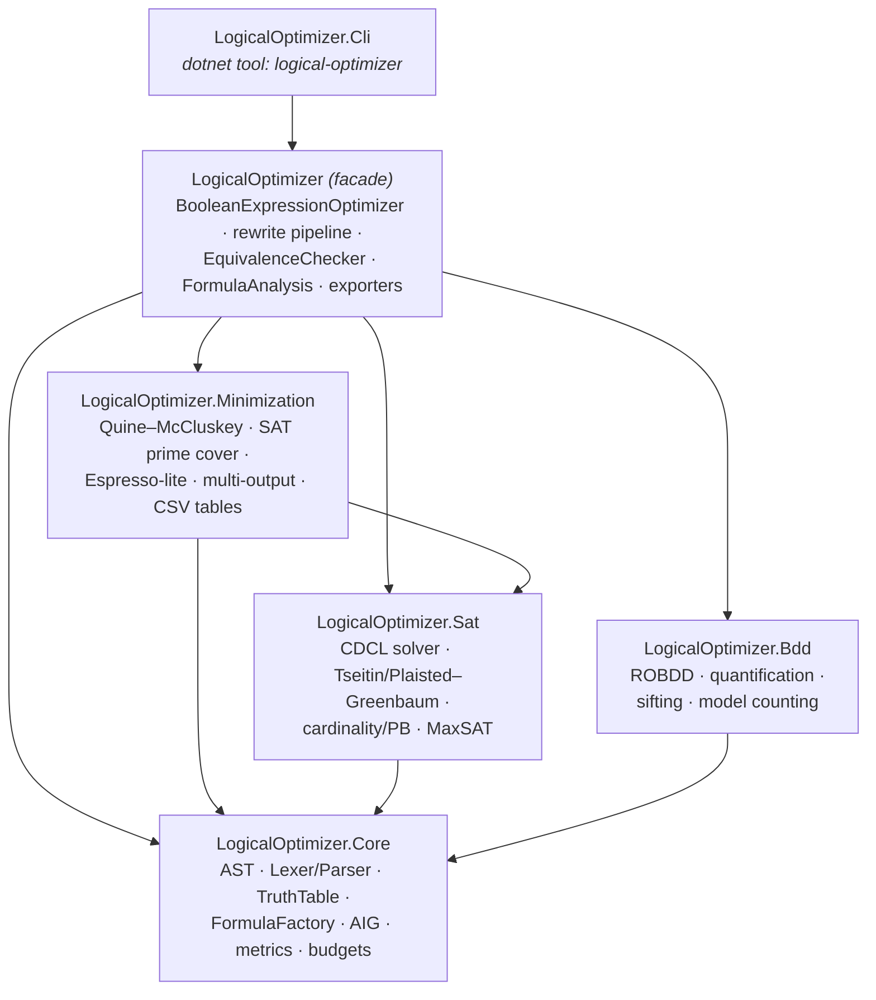
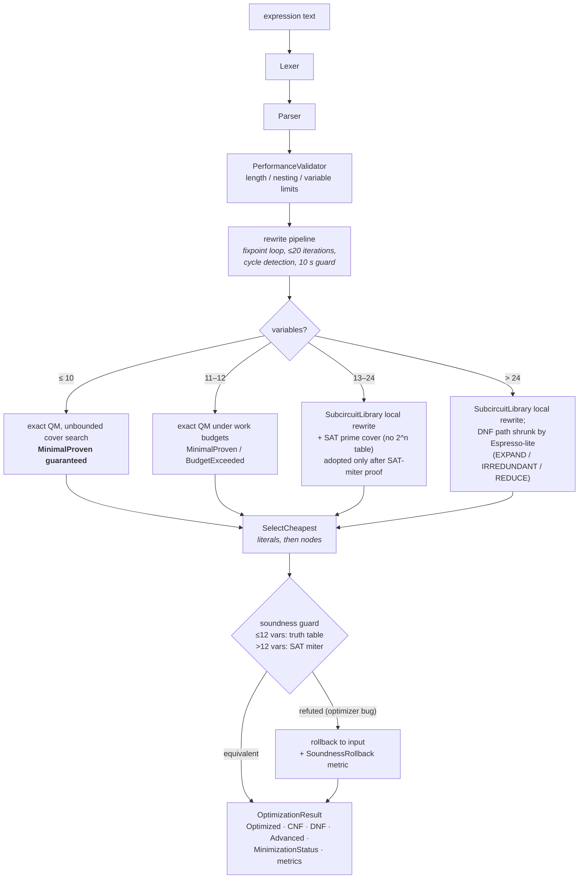
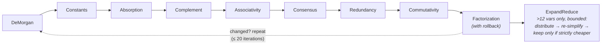
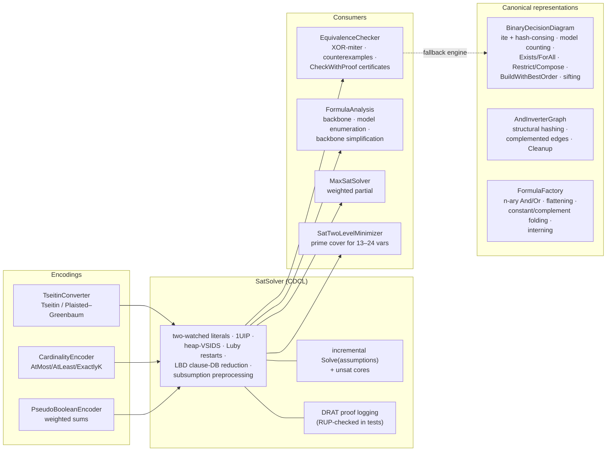

# LogicalOptimizer - Boolean Expression Optimizer

> **🤖 AI-Assisted Development Notice**
> 
> This project was developed with extensive assistance from Large Language Models (LLM), including:
> - Architecture design and implementation guidance
> - Code generation and optimization techniques
> - Comprehensive testing framework creation
> - Documentation and specification writing
> - Best practices implementation and code quality improvements
>
> The collaboration between human creativity and AI capabilities resulted in a robust, well-tested boolean expression optimization system with advanced features and comprehensive documentation.

## Overview

LogicalOptimizer is a lightweight, dependency-free .NET library and CLI for parsing, optimizing and transforming boolean expressions. Exact minimization is attempted up to 12 variables and **optimality is reported explicitly when proven**: `OptimizationResult.MinimizationStatus` is `MinimalProven` when the exact minimum-cover search completed (the normal case for ≤10 variables — verified for every 3- and 4-variable function), `BudgetExceeded` when a work limit interrupted the proof, and `Heuristic` beyond the exact range. There are no silent fallbacks. **Every** optimization is verified equivalent to the input before being returned — by truth table up to 12 variables, by the built-in CDCL SAT solver (miter proof) beyond that.

**Cost model**: the minimal cover is chosen by total literal count, then term count; the final multi-level expression is chosen by literal count, then AST node count. This is not the same as minimal gate count, circuit depth, or delay.

## Features

- ✅ **Core Boolean Operations**: AND (`&`), OR (`|`), NOT (`!`) with proper precedence
- ✅ **Provable Minimality with Explicit Status**: exact Quine-McCluskey backend with covering-table reductions and lower-bound-pruned branch-and-bound; `MinimizationStatus` reports `MinimalProven` / `BudgetExceeded` / `Heuristic` — never a silent downgrade
- ✅ **Smart Optimization**: All basic laws of boolean algebra with factorization, consensus, expand-reduce
- ✅ **Built-in SAT Solver**: dependency-free CDCL (watched literals, 1UIP learning, heap-VSIDS, Luby restarts, LBD clause-database reduction, subsumption preprocessing); incremental solving under assumptions with unsat cores
- ✅ **DRAT Proofs**: UNSAT verdicts (including equivalence proofs via `CheckWithProof`) come with externally checkable DRAT certificates
- ✅ **SAT-Based Mid-Range Minimization**: prime-cover SOP for 13-24 variables without any 2^n table, adopted only after a SAT-miter equivalence proof
- ✅ **Espresso-Style Large-Scale Minimization**: cube-list EXPAND/IRREDUNDANT/REDUCE with exact cofactor-tautology validation (`Transformations.MinimizeDnfHeuristic`) — shrinks DNF covers at 40+ variables, sound by construction
- ✅ **Optimal Subcircuit Rewriting**: every ≤3-variable subtree drops to its provably minimal precomputed form (256-function library built by the exact minimizer)
- ✅ **And-Inverter Graph**: ABC-style AIG with structural hashing and complemented edges (`AndInverterGraph`) — honest multi-level size metrics and a foundation for cut-based rewriting
- ✅ **Backbone & Model Enumeration**: `FormulaAnalysis.ComputeBackbone`, projected lazy model enumeration, backbone-based simplification
- ✅ **Cardinality / Pseudo-Boolean / MaxSAT**: sequential-counter AtMost/AtLeast/ExactlyK, weighted PB constraints, weighted partial MaxSAT — all in-house
- ✅ **Tseitin & Plaisted–Greenbaum CNF**: linear-size equisatisfiable CNF for any expression (`--cnf-mode=tseitin`, `ToEquisatisfiableCnf`); the polarity-based Plaisted–Greenbaum style (`CnfEncodingStyle.PlaistedGreenbaum`) cuts clause count up to ~2x
- ✅ **ROBDD Engine**: canonical binary decision diagrams with hash-consing, model counting, lazy assignment enumeration, existential/universal quantification, restriction, functional composition, variable-order optimization (`BuildWithBestOrder` heuristics + `BuildWithSiftedOrder` sifting), node budget
- ✅ **Formula Factory**: LogicNG-style construction (`FormulaFactory`) — n-ary And/Or with flattening, duplicate removal, constant/complement folding and structural interning (equal formulas are the same instance)
- ✅ **Modular Packages**: `LogicalOptimizer.Core` / `.Sat` / `.Bdd` / `.Minimization` are independently usable NuGet packages; the `LogicalOptimizer` facade ties them together and the layering is enforced by an architecture test
- ✅ **Multi-Output Minimization**: CSV tables with several output columns (`--outputs=Sum,Carry`), shared don't-cares and PLA-style cube sharing across outputs
- ✅ **Budgets & Cancellation**: `ResourceBudget` + `CancellationToken` on every expensive engine
- ✅ **Normal Forms**: Conversion to CNF (Conjunctive) and DNF (Disjunctive)
- ✅ **Advanced Logic Forms**: Extended operators (XOR, IMP, EQV) generation 
- ✅ **Context-Aware Formatting**: Intelligent parentheses placement
- ✅ **Truth Table Generation**: Up to 20 variables with equivalence verification
- ✅ **Multiple Export Formats**: DIMACS, BLIF, Verilog, CSV, Mathematical notation, LaTeX
- ✅ **Performance Analytics**: Detailed metrics and benchmarking
- ✅ **Comprehensive Testing**: 866 audited tests (full-suite audit removed ~180 duplicate/tautological tests and strengthened weak oracles) across ten systematic techniques — property-based (CsCheck), metamorphic, algebraic, differential (with SymPy and Z3 as external oracles), fuzzing, characterization golden master, snapshot approval (Verify), architecture rules (ArchUnitNET), pairwise option coverage, and Stryker.NET mutation testing with per-module survivor triage (see [doc/TESTING.md](doc/TESTING.md))
- ✅ **Error Protection**: Input validation and infinite loop prevention

## Quick Start

### Installation

As NuGet packages (the facade pulls in all four engine packages; packages are
published by the release workflow on version tags):

```bash
dotnet add package LogicalOptimizer          # facade: everything below
# or pick individual layers:
dotnet add package LogicalOptimizer.Core     # AST, parser, truth tables, FormulaFactory, AIG
dotnet add package LogicalOptimizer.Sat      # CDCL solver, CNF encodings, MaxSAT
dotnet add package LogicalOptimizer.Bdd      # ROBDD
dotnet add package LogicalOptimizer.Minimization  # QM, Espresso-lite, multi-output

# CLI as a global dotnet tool
dotnet tool install -g LogicalOptimizer.Cli  # command: logical-optimizer
```

From source (requires the .NET 10 SDK):

```bash
git clone https://github.com/AlexanderV/LogicalOptimizer.git
cd LogicalOptimizer
dotnet build
```

### Basic Usage
```bash
# Expression optimization
dotnet run --project LogicalOptimizer.Cli -- "a & b | a & c"
# Output:
# Original: a & b | a & c
# Optimized: a & (b | c)
# CNF: a & (b | c)
# DNF: a & b | a & c
# Variables: [a, b, c]
# (a truth table follows for expressions with ≤ 6 variables — omitted here;
#  the Advanced line is printed only when a pattern is found)

# Expression with XOR pattern
dotnet run --project LogicalOptimizer.Cli -- "a & !b | !a & b"
# Output:
# Original: a & !b | !a & b
# Optimized: a & !b | b & !a
# CNF: (a | b) & (!a | !b)
# DNF: a & !b | b & !a
# Variables: [a, b]
# Advanced: a XOR b

# Complex expression with multiple patterns (XOR + IMP)
dotnet run --project LogicalOptimizer.Cli -- "((a & !b) | (!a & b)) & ((!c | d) | (e & f))"
# Output:
# Original: ((a & !b) | (!a & b)) & ((!c | d) | (e & f))
# Optimized: (d | !c | e & f) & (a & !b | b & !a)
# CNF: (a | b) & (!a | !b) & (d | e | !c) & (d | f | !c)
# DNF: b & d & !a | a & d & !b | a & !b & !c | b & !a & !c | b & e & f & !a | a & e & f & !b
# Variables: [a, b, c, d, e, f]
# Advanced: ((c → d) | e & f) & (a XOR b)

# Get only CNF (Conjunctive Normal Form)
dotnet run --project LogicalOptimizer.Cli -- --cnf "a & b | c"
# Result: (a | c) & (b | c)

# Get only DNF (Disjunctive Normal Form)
dotnet run --project LogicalOptimizer.Cli -- --dnf "(a | b) & c"
# Result: a & c | b & c

# Get only Advanced logical forms
dotnet run --project LogicalOptimizer.Cli -- --advanced "a & !b | !a & b"
# Result: (a XOR b)

dotnet run --project LogicalOptimizer.Cli -- --advanced "!a | b"
# Result: a → b

dotnet run --project LogicalOptimizer.Cli -- --advanced "a & b | !a & !b"
# Result: a ↔ b

# Detailed output with metrics and minimality status
dotnet run --project LogicalOptimizer.Cli -- --verbose "!(a & b)"
# Output includes: Iterations, Elapsed time, Minimality: MinimalProven

# Multi-output CSV minimization with shared cubes
dotnet run --project LogicalOptimizer.Cli -- --outputs=Sum,Carry "a,b,Sum,Carry\n0,0,0,0\n0,1,1,0\n1,0,1,0\n1,1,0,1"
# Output:
# Sum = a & !b | b & !a
# Carry = a & b

# Features demonstration
dotnet run --project LogicalOptimizer.Cli -- --demo

# Performance benchmarks
dotnet run --project LogicalOptimizer.Cli -- --benchmark

# Help
dotnet run --project LogicalOptimizer.Cli -- --help
```

## Supported Operators

### Core Operators
| Operator | Description | Priority | Example |
|----------|-------------|----------|---------|
| `!` | Logical NOT (negation) | 1 (Highest) | `!a` |
| `&` | Logical AND (conjunction) | 2 (Medium) | `a & b` |
| `\|` | Logical OR (disjunction) | 3 (Lowest) | `a \| b` |
| `()` | Grouping | - | `(a \| b) & c` |
| `0`, `1` | Logical constants | - | `a & 1` |

### Advanced Logical Forms
| Form | Description | Pattern | Advanced Display |
|------|-------------|---------|------------------|
| **XOR** | Exclusive OR | `a & !b \| !a & b` | `a XOR b` |
| **IMP** | Implication | `!a \| b` | `a → b` |
| **EQV** | Equivalence (Biconditional) | `a & b \| !a & !b` | `a ↔ b` |

**Note**: Advanced forms are generated for display purposes and logical clarity. All internal processing uses core operators only.

## Usage Examples

### Factorization (main example from specification)
```bash
Input: "(a | b) & (a | c)"
Output: "a | (b & c)"
```

### De Morgan's Laws
```bash
Input: "!(a & b)"
Output: "!a | !b"
```

### Constants Simplification
```bash
Input: "a & 1 | b & 0"
Output: "a"
```

### Consensus rule
```bash
Input: "a & b | !a & c | b & c"
Output: "a & b | c & !a"
```

### Advanced Pattern Recognition
```bash
# XOR Pattern Detection
Input: "a & !b | !a & b"
Output: "a XOR b"

# Implication Pattern Detection  
Input: "!a | b"
Output: "a → b"

# Equivalence Pattern Detection
Input: "a & b | !a & !b"
Output: "a ↔ b"

# Complex Mixed Patterns
Input: "((a & !b) | (!a & b)) & ((!c | d) | (e & f))"
Output: "((c → d) | e & f) & (a XOR b)"
```

## Programming Interface (API)

```csharp
using LogicalOptimizer;

var optimizer = new BooleanExpressionOptimizer();
var result = optimizer.OptimizeExpression("a & b | a & c", includeMetrics: true);

Console.WriteLine($"Original: {result.Original}");
Console.WriteLine($"Optimized: {result.Optimized}");
Console.WriteLine($"CNF: {result.CNF}");
Console.WriteLine($"DNF: {result.DNF}");
Console.WriteLine($"Variables: [{string.Join(", ", result.Variables)}]");

// Performance metrics
if (result.Metrics != null)
{
    Console.WriteLine($"Time: {result.Metrics.ElapsedTime.TotalMilliseconds:F2}ms");
    Console.WriteLine($"Nodes: {result.Metrics.OriginalNodes} → {result.Metrics.OptimizedNodes}");
    Console.WriteLine($"Iterations: {result.Metrics.Iterations}");
    Console.WriteLine($"Rules applied: {result.Metrics.AppliedRules}");
}

// Equivalence verification through truth tables
Console.WriteLine($"Equivalent to original: {result.IsEquivalent()}");
```

## Export Formats

The optimizer supports multiple export formats for integration with external tools:

```csharp
using LogicalOptimizer;

string expression = "a & b | c";

// Export to DIMACS format (for SAT solvers)
string dimacs = BooleanExpressionExporter.ToDimacs(expression);

// Export to BLIF format (for digital circuit design)
string blif = BooleanExpressionExporter.ToBlif(expression, "my_circuit");

// Export to Verilog format (for hardware description)
string verilog = BooleanExpressionExporter.ToVerilog(expression, "my_module");

// Export to mathematical notation (Unicode symbols)
string math = BooleanExpressionExporter.ToMathematicalNotation(expression);
// Result: "a ∧ b ∨ c"

// Export to LaTeX format (for academic papers and documents)
string latex = BooleanExpressionExporter.ToLatex(expression);
// Result: "a \\land b \\lor c"

// Export truth table to CSV
string csv = BooleanExpressionExporter.TruthTableToCsv(expression);
```

## Testing

```bash
# Full test suite
dotnet test

# Filtered tests
dotnet test --filter "TruthTable"

# Performance tests
dotnet test --filter "Performance"

# Mutation testing (Stryker.NET; report in StrykerOutput/)
dotnet tool restore
cd LogicalOptimizer.Tests && dotnet stryker
```

The suite layers ten systematic techniques (property-based, metamorphic, algebraic,
differential, fuzzing, characterization, snapshot approval, architecture rules,
pairwise, mutation) on top of the example-based tests — the full map with per-technique
rationale and regeneration instructions is in [doc/TESTING.md](doc/TESTING.md).

## Advanced Features

### Performance Validation
```bash
# Run comprehensive benchmarks
dotnet run --project LogicalOptimizer.Cli -- --benchmark

# Performance analysis for specific expression
dotnet run --project LogicalOptimizer.Cli -- --verbose "complex_expression_here"

# BenchmarkDotNet suite with machine-readable JSON results (doc/BENCHMARKS.md)
dotnet run -c Release --project LogicalOptimizer.Benchmarks -- --filter *
```

### AST Visualization
The system provides Abstract Syntax Tree visualization for debugging and educational purposes:

```csharp
var optimizer = new BooleanExpressionOptimizer();
var result = optimizer.OptimizeExpression("(a | b) & (c | d)",
    new OptimizationOptions { IncludeMetrics = true, IncludeDebugInfo = true });

// Human-readable debug dump: original and optimized AST trees + metrics
Console.WriteLine(result.DebugInfo);
```

### Quality Analysis
Built-in optimization quality analyzer provides detailed metrics:
- Expression complexity reduction percentage
- Number of optimization rules applied
- Convergence analysis
- Memory usage statistics

## Requirements

- **Library packages**: .NET 8.0 or higher (multi-targeted `net8.0;net10.0`)
- **CLI tool / building from source**: .NET 10 SDK
- **Operating System**: Windows, Linux, or macOS
- **Memory**: Minimum 512MB RAM (1GB+ recommended for large expressions)
- **Storage**: 50MB free disk space

## Documentation

- 📖 **[Technical Specification](doc/Spec.md)** - Complete system specification
- 🚀 **[Advanced Features Guide](doc/ADVANCED_FEATURES.md)** - Extended functionality documentation
- 🧪 **[Testing Strategy](doc/TESTING.md)** - Ten testing techniques, actuality matrix, audit log, mutation results
- 📊 **[Benchmarks](doc/BENCHMARKS.md)** - BenchmarkDotNet results with machine-readable JSON artifacts

## Limitations

- Maximum expression length: 10,000 characters
- Maximum number of variables: 100
- Maximum nesting depth: 50 levels
- Maximum processing time: 10 seconds
- Maximum optimization iterations: 20

## Architecture

### Package layering

Six NuGet packages with acyclic, downward-only dependencies (enforced by an
architecture test):



### Optimization flow (facade)

Every result is verified equivalent to the input before it is returned; minimality
claims carry an explicit status.



### Rewrite pipeline (the rule zoo)

Applied in order inside the fixpoint loop; factorization runs under a global
rollback because it may grow the tree:



### Engine zoo



## Project Statistics

- **Total tests**: 866 (all passing; performance and exhaustive-sweep categories run outside CI via --filter; suite fully audited 2026-07 — see doc/TESTING.md Part 4)
- **Code coverage**: ~93% line coverage (CI enforces an 80% floor)
- **Mutation scores** (Stryker.NET, per module): Transformations 100%, TruthTableMinimizer 82.6%, EspressoLite 72.5%, SatSolver 52.5% — every survivor killed or classified equivalent (doc/TESTING.md Part 5)
- **Minimization engines**: 4 zones — exact QM (≤12 vars, proven ≤10), SAT prime cover (13–24), Espresso-lite cube lists (beyond), plus the precomputed 3-input subcircuit library
- **Rewrite rules**: 9-stage pipeline (De Morgan, constants, absorption, complement, associativity, consensus, redundancy, commutativity, factorization) + bounded expand-reduce
- **Pattern recognition**: XOR, IMP, and EQV pattern detection and replacement
- **Export formats**: 6 (DIMACS, BLIF, Verilog, Mathematical, LaTeX, CSV)
- **Operator support**: 3 core operators (AND, OR, NOT) in the text grammar + XOR, IMP, EQV, NAND, NOR node types in the AST/API
- **Truth table capacity**: Up to 20 variables (1M+ combinations)
- **Platform support**: Cross-platform (packages net8.0/net10.0; CLI net10.0)

## Contributing

1. Fork the repository
2. Create a feature branch (`git checkout -b feature/AmazingFeature`)
3. Commit your changes (`git commit -m 'Add some AmazingFeature'`)
4. Push to the branch (`git push origin feature/AmazingFeature`)
5. Open a Pull Request

## License

Distributed under the Apache 2.0 License. See [LICENSE](LICENSE) for more information.

## Contact

Project: [https://github.com/AlexanderV/LogicalOptimizer](https://github.com/AlexanderV/LogicalOptimizer)

## Versioning policy

The project follows [Semantic Versioning](https://semver.org/): patch/minor releases are additive-only; any breaking change to the public API requires a major version bump. The API surface is enforced by two tests: `ApiSurfaceTests.PublicApi_MatchesApprovedBaseline` pins the full member-level API in `LogicalOptimizer.Tests/TestData/PublicApi.approved.txt` (regenerate an intended change with `LOGICALOPTIMIZER_REGENERATE_API=1` and review the diff), and `ArchitectureTests.PublicSurface_IsTheDocumentedSet` pins the public type list. A failing baseline is a release decision, not a test to silence.
