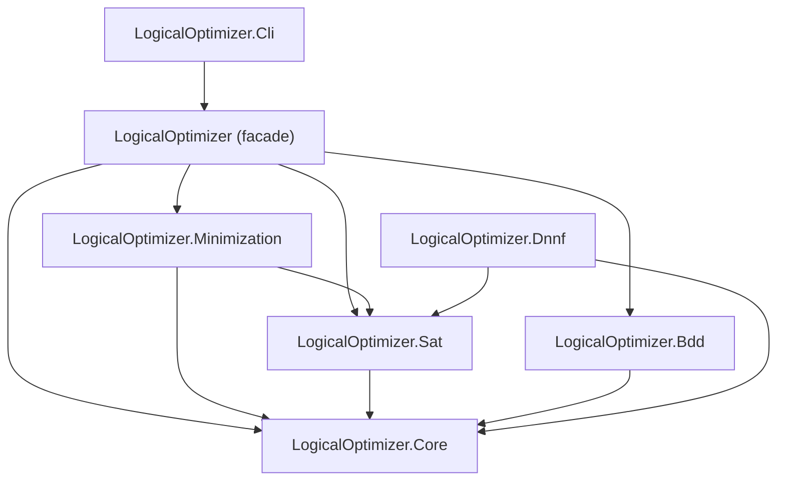
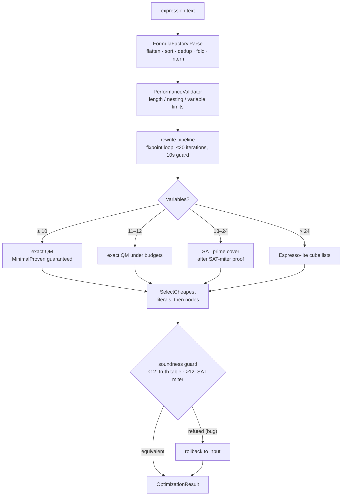

# Packages & Architecture

## The package split

LogicalOptimizer ships as **seven** NuGet packages — six independently usable libraries
plus the CLI tool. Dependencies are **acyclic and downward-only**, and the layering is
enforced by an architecture test.

| Package | Responsibility |
|---|---|
| **LogicalOptimizer.Core** | n-ary AST, `FormulaFactory` (parse + canonicalize), `AstFormatter`, `TruthTable`, metrics, `ResourceBudget`, `PerformanceValidator`. Depends on nothing. |
| **LogicalOptimizer.Sat** | CDCL solver, Tseitin / Plaisted–Greenbaum CNF, cardinality / pseudo-Boolean, MaxSAT. Depends on Core. |
| **LogicalOptimizer.Bdd** | ROBDD with hash-consing, model counting, quantification, sifting. Depends on Core. |
| **LogicalOptimizer.Dnnf** | Top-down d-DNNF knowledge compiler: exact `#SAT` model counting, weighted model counting, model enumeration. Depends on Sat + Core. See [Knowledge Compilation & Model Counting](knowledge-compilation.md). |
| **LogicalOptimizer.Minimization** | Quine–McCluskey, SAT prime cover, Espresso-lite, multi-output CSV. Depends on Sat + Core. |
| **LogicalOptimizer** (facade) | `BooleanExpressionOptimizer`, the rewrite pipeline, `EquivalenceChecker`, `FormulaAnalysis`, exporters. Depends on Core/Sat/Bdd/Minimization. |
| **LogicalOptimizer.Cli** | The `logical-optimizer` global tool. Depends on the facade. |

`LogicalOptimizer.Dnnf` is standalone: it is consumed directly rather than pulled in by
the facade.



Take just the layer you need: `LogicalOptimizer.Sat` for a dependency-free CDCL solver,
`LogicalOptimizer.Bdd` for an ROBDD engine, `LogicalOptimizer.Minimization` for exact
two-level minimization — or the `LogicalOptimizer` facade for the whole pipeline.

## `FormulaFactory` — the construction entry point

Since v2.0 there is exactly **one** way to build And/Or trees: `FormulaFactory`. It is the
single entry point for constructing and parsing formulas (`Parse`, `And` / `Or` / `Not` /
`Variable`, `Import`), and it canonicalizes at construction time:

- **flatten** — `a & (b & c)` becomes one `AndNode` with operands `[a, b, c]`;
- **sort** — operands take a stable canonical order (`c & a & b` → `a & b & c`);
- **dedup** — `a & a` → `a` (idempotence);
- **constant folding** — `a & 1` → `a`, `a | 1` → `1`, `!!a` → `a`;
- **complement folding** — `a & !a` → `0`, `a | !a` → `1`;
- **interning** — structurally equal factory-built trees are the *same instance*, so
  reference equality works for canonical trees.

Two consequences worth internalizing:

1. **Degenerate formulas fold to constants at parse time.** `f.Parse("a | !a")` returns
   the constant `1`, not an `OrNode`.
2. **Output strings are canonically ordered.** `f.Parse("c & a & b").ToString()` is
   `"a & b & c"`.

```csharp
var f = new FormulaFactory();
var parsed = f.Parse("c & a & b");
Console.WriteLine(parsed);                          // a & b & c
var and = (AndNode)parsed;
Console.WriteLine(and.Operands.Count);              // 3 (n-ary, flattened)
Console.WriteLine(ReferenceEquals(parsed, f.And(    // True (interning)
    f.Variable("a"), f.Variable("b"), f.Variable("c"))));
```

## The n-ary canonical AST

The canonical core is `And` / `Or` / `Not` / `Variable` / `Constant`. And/Or are **n-ary**:
one n-ary `AndNode` / `OrNode` counts as **1 node** regardless of how many operands it has
(this is the v2 cost model — see the [migration guide](migration-v2.md)). The derived
binary nodes `XorNode` / `ImpNode` / `EqvNode` / `NandNode` / `NorNode` live *outside* the
canonical core: they are used only for extended-syntax parsing and pattern-recognition
display; `FormulaFactory.Import` decomposes them into And/Or/Not.

## Optimization flow (facade)

Every result is verified equivalent to the input before it is returned; minimality claims
carry an explicit status.



## Internal engines

Beyond the facade pipeline, the packages expose the standalone engines directly: the CDCL
`SatSolver` (two-watched literals, 1UIP learning, heap-VSIDS, Luby restarts, LBD clause-DB
reduction, subsumption; incremental solving with unsat cores and DRAT proofs), the
`BinaryDecisionDiagram` ROBDD (model counting, `Exists` / `ForAll`, `Restrict` / `Compose`,
`BuildWithBestOrder` / sifting), the cardinality / pseudo-Boolean / MaxSAT encoders, and
the two-level minimizers. See the [API Reference](../api/index.md) for the full member list.
